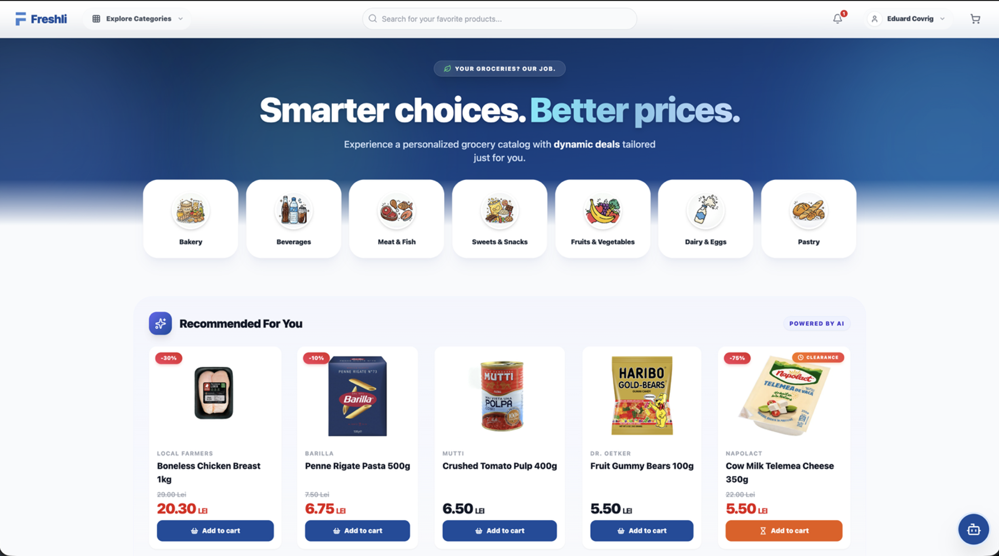
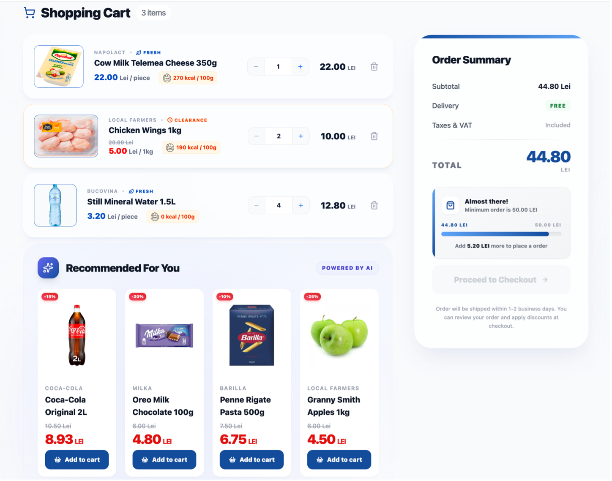
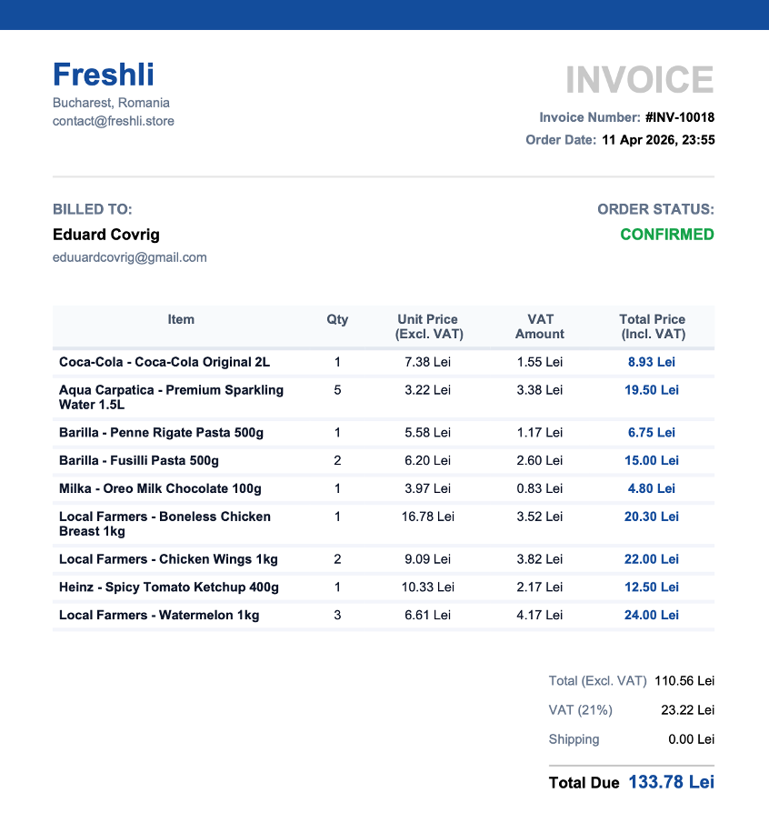
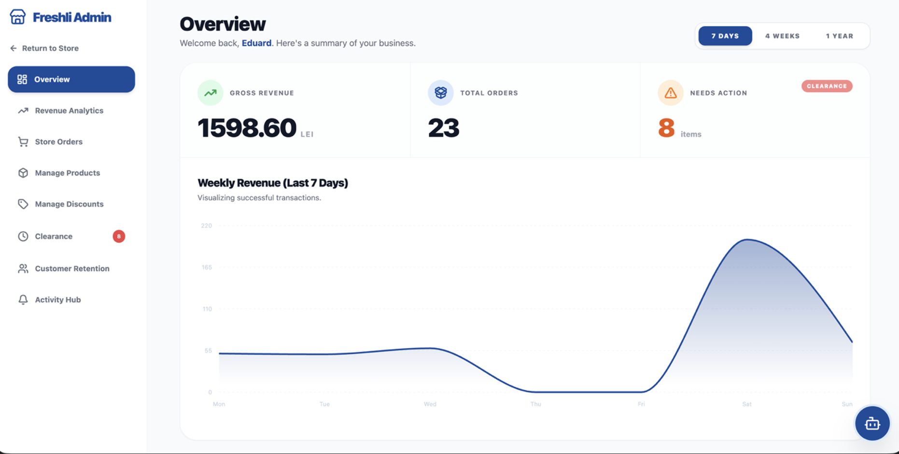

# Freshli - AI-Powered Grocery Platform 🛒

Welcome to **Freshli**. The idea behind Freshli was to rethink how an online grocery store should work. It's not just a standard e-commerce site. It's a smart platform that dynamically adjusts prices based on expiration dates to reduce food waste, uses AI to recommend products, and predicts customer churn, all within an easy-to-use interface, ***without any additional clutter***.

The goal was to build something realistic, fast, and packed with smart features that both customers and store admins would love.

---

## 🌐  Live Demo
You can try out the live platform right now at: **[freshli.store](https://freshli.store)**

> ⏳ **Heads up:** The backend and AI services are currently hosted on free-tier platforms. If no one has visited the site in a while, the servers go to sleep. **The initial load (or the first AI chat response) might take up to a minute to wake up.** Thanks for your patience! 

---

## 📸 Sneak Peek 

| Storefront | Shopping Cart |
| :---: | :---: |
|  |  |
| **Auto-generated Invocie** | **Admin Dashboard** |
|  |  |


---

## 🚀 Key Features

### 🛒 For the Customers:
* **"Freshli AI" Chatbot:** An integrated Groq-powered assistant that knows the store's inventory, speaks the user's language natively, and helps find products or recipes.
* **Stripe Integration:** Fully functional payment gateway using Stripe Elements.
* **AI Recommendations:** The system learns from user interactions (Views, Cart Adds, Purchases) and suggests products using a Collaborative Filtering model (Cosine Similarity).
* **Smart Cart & Dynamic Pricing:** Prices drop automatically as products get closer to their expiration date (Clearance deals: 25%, 55%, 75% off).
* **PDF Invoices:** Automatic invoice generation using `jspdf` right after placing an order.

### 💼 For the Admins:
* **Churn Prediction:** A dedicated dashboard running a Random Forest Classifier to identify users likely to abandon the platform, allowing admins to send them automated "Comeback" discount codes via email.
* **Inventory & Expiration Management:** Easily track batches, see what needs to go on "Clearance," and manage active promotions.
* **Analytics:** Track revenue, order statuses, and overall platform health in real-time.
* **Email Notifications:** Sending beautiful, responsive HTML emails via Brevo (Sendinblue) for order confirmations and password resets.

---

## 🛠️ Tech Stack

This project is built using a modern microservices architecture:

* **Backend (Core):** Java 21, Spring Boot 3, Spring Security (JWT), Hibernate / Spring Data JPA.
* **Frontend:** React 19, TypeScript, Vite, Tailwind CSS, Shadcn UI, Zustand/Context API.
* **Backend (AI/ML Service):** Python 3.11, FastAPI, Pandas, Scikit-learn (Random Forest), Groq API (LLaMA 3).
* **Database:** PostgreSQL (with an base seed script for initial testing).
* **3rd Party Services:** Stripe (Payments), Brevo (Mailing).

---

## ⚙️ How to Run It Locally

To get Freshli running on your machine, you'll need **Java 21**, **Node.js**, **Python 3.11**, and **PostgreSQL** installed.

### 1. Database Setup
1. Create a new PostgreSQL database (e.g., `freshli_db`).
2. The Spring Boot backend will automatically create the tables when you run it for the first time.
3. To populate the store with products, users, and ML training data, run the SQL scripts found in the `db/` folder in numerical order (01 to 09).

### 2. Spring Boot Backend
1. Navigate to the `back/` folder.
2. Rename `src/main/resources/application.properties.example` to `application.properties`.
3. Fill in your PostgreSQL credentials, JWT secret, Stripe key, and Brevo SMTP details.
4. Run the application:
   ```bash
   ./mvnw spring-boot:run
   ```
   *Starts on `http://localhost:8080`.*

### 3. Python AI Service
1. Navigate to the `ai-service/` folder.
2. Rename the `.env.example` file to `.env` and fill your DB details and `GROQ_API_KEY`.
3. Set up a virtual environment and install dependencies:
   ```bash
   python3 -m venv venv
   source venv/bin/activate
   pip install -r requirements.txt
   ```
4. *Important:* Train the model before starting:
   ```bash
   python3 train-churn.py
   ```
5. Start the service
   ```bash
   python3 run.py
   ```
   *Starts on `http://localhost:8000`.*
### 4. Frontend
1. Go to `front/`.
2. Rename the `.env.example` file to `.env` and fill your data.
3. Install dependencies:
   ```bash
   npm install
   ```
4. Start the app
   ```bash
   npm run dev
   ```
*Available at `http://localhost:5173`.*

## 👤 Test Accounts
You can create your own accounts, or use any [pre-seeded accounts](db/02_seed_users_addresses.sql). 
*All pre-seeded accounts have the same base encrypted password: `password`.*
